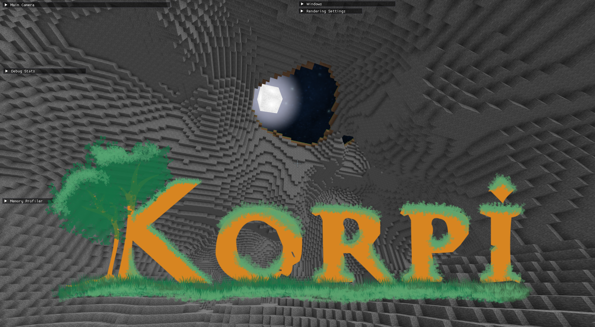

# Korpi

[](https://github.com/japsuu/Korpi/actions/workflows/build_client.yml)
[](https://github.com/japsuu/Korpi/tree/master/tests/client)
[](https://japsuu.github.io/Korpi/)
[](https://discord.gg/EFYfVc3vcb)




Korpi is a voxel[*](https://japsuu.github.io/Korpi/faq/#voxel-engine-vs-korpi) engine written in C#, that uses OpenGL as the rendering backend.

This project is still searching for its own identity :)

I also post development updates to YouTube every once in a while:
https://youtube.com/@devlogs

## Table of Contents

- [Project goals](#project-goals)
- [Personal goals](#personal-goals)
- [Project status](#project-status)
- [Documentation](#documentation)
- [Building from source](#building-from-source)
- [Contributing](CONTRIBUTING.md)
- [Lessons learned](#lessons-learned)
- [Credits](#credits)
- [Terms](#terms)

## Project goals

The long-term goal of this project is to eventually develop into its own game, with player-hosted servers and official modding support.

## Personal goals

This is my first-ever custom game engine. I haven't dabbled with OpenGL before, nor have I worked on a proper game project without an engine or a framework.

My main goal with this project is to get familiar with OpenGL and the ins and outs of engine/tool development.

## Project status

A non-exhaustive list of currently implemented features. Updated every once in a while.

> The implementation details of the listed features can be found in the [technical documentation](https://japsuu.github.io/Korpi/technical/index.html).

- Rendering pipeline
  - [x] Multithreaded chunk meshing
  - [x] Ambient occlusion
  - [x] Frustum culling
  - [x] Internal face culling
  - [x] Weighted-Blended Order-Independent Transparency
  - [x] Block texturing (animated texture support!)
  - [x] Block face shading
  - [x] ImGui integration
  - [x] Dynamic skybox
- Data management
  - [x] Palette-based block compression
  - [x] World Chunking
    - [x] Multithreaded chunk generation
    - [x] ~~Cubic chunks~~ ([UPDATE](https://japsuu.github.io/Korpi/technical/data-management/world-chunking.html))
    - [x] Chunk loading/unloading (world streaming)
    - [x] Seamless chunk borders
  - Mod support
    - [x] Adding new blocks/textures with YAML
- Threading
  - [x] Custom priority-based thread pool
  - [x] Custom job system
  - [x] Multithreaded world generation (<1ms for 32^3 chunk)
  - [x] Multithreaded chunk meshing (<1ms for 32^3 chunk)
- Physics
  - [x] Raycasting
- World generation
  - [x] Simplex noise-based terrain heightmap generation
  - [x] Cave generation
- Gameplay
  - [x] ECS-based player character, with free cam mode
- Misc
  - [x] JSON-based settings/config system
  - [x] Shader hot reloading
  - [x] Log4net integration
  - [x] Self-profiling with DotTrace
  - [x] Custom ImGui-based profiler
  - [x] Autogenerated API documentation
  - [x] Automated testing
  - [x] Debug drawing library

## Documentation

Technical documentation and additional information about the implementation of Korpi can be found in the [official documentation](https://japsuu.github.io/Korpi/).

The full API Documentation is available on the [official API documentation](https://japsuu.github.io/Korpi/api/index.html) or inline from your favourite IDE.

## Cloning the source
To clone the source of Korpi for development purposes, you just need to clone the git repo and open `Korpi.sln` in your favourite IDE.

```git
git clone https://github.com/japsuu/Korpi   # Download source code from git
cd korpi   # Enter the source directory
# open Korpi.sln
```

## Lessons learned

- I can do it! :)
- Don't be afraid to try out new things (looking at you, shader development)
- Trying to keep hundreds of millions of voxels in memory at the same time is troublesome
- Writing unit tests is usually worth the extra effort
- Multithreading isn't as hard as people claim it to be
- Premature optimization is the root of all evil. Rather ship an unoptimized game than no game at all.
- Engine development is really fun!

## Credits

- xMrVizzy ([Faithful 32x](https://www.curseforge.com/minecraft/texture-packs/faithful-32x) texture pack, used as programmer-art for some of the block textures)
- Westbeam ([Space Skybox](https://opengameart.org/content/space-skybox-0) cc0, used as programmer-art for the night skybox)
- Spiney ([Cloudy Skyboxes](https://opengameart.org/content/cloudy-skyboxes) cc-by 3.0, used as programmer-art for the day skybox)

## Terms

You may freely read the source, learn from it, and use it as a basis for mods of the game Korpi. All contributions are of course welcome!

In case of doubt, just ask the Korpi development team! :-)

Make sure to read the [licence](https://github.com/japsuu/Korpi/blob/master/LICENCE.md).
