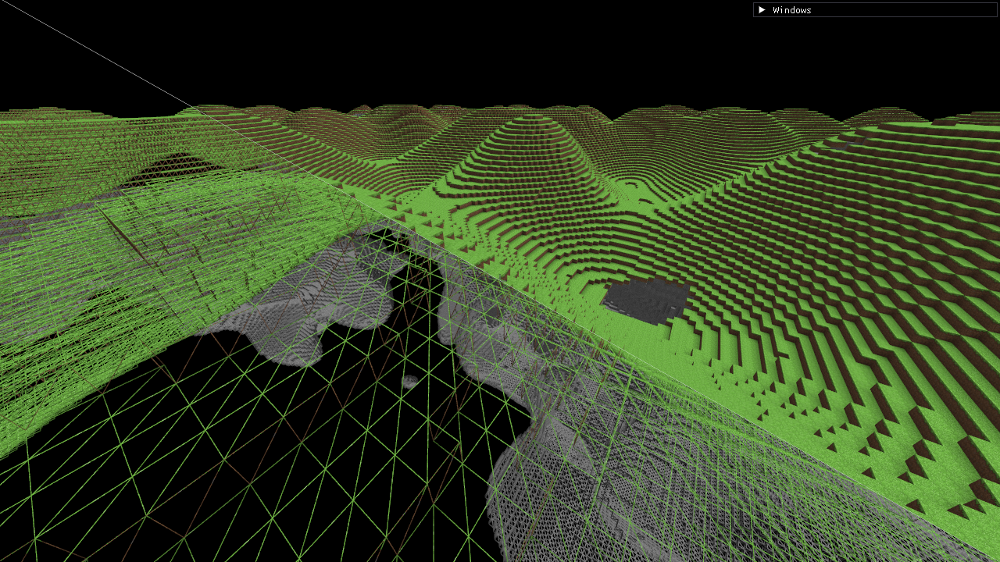
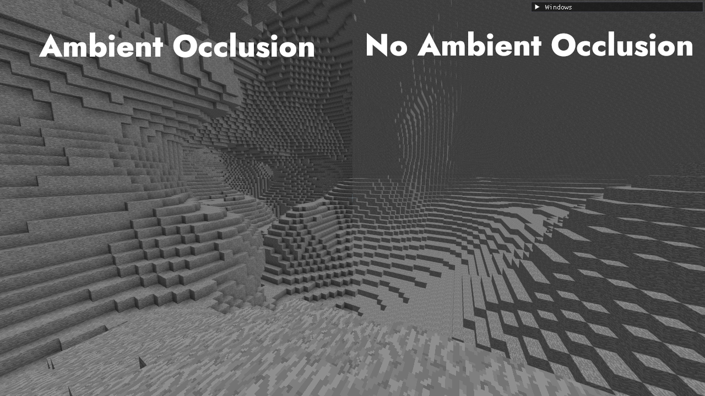

## Rendering pipeline

> TODO: More info.

The engine has a fully functional OpenGL voxel rendering pipeline.
A chunk is passed to a multithreaded chunk mesher, which uses a meshing buffer to create vertices and indices, used to construct a polygonal mesh for the chunk.
The mesh is rendered by a shader which unpacks the bitpacked vertex data, positions the vertices based on the chunk position, assigns textures, applies shading, and renders the fragments.

The ambient occlusion (AO) is also baked in to the mesh vertex data, which allows for a more efficient rendering pipeline, as the AO is calculated only once per chunk, instead of every frame.

AFAIK Minecraft uses a similar technique for smooth lighting.